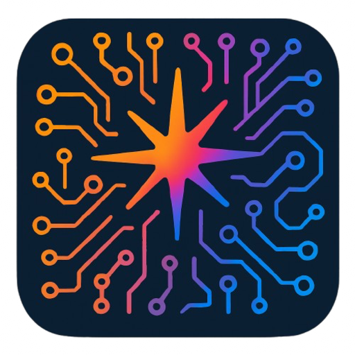

# POPAI - Your Floating AI Assistant 🤖

<div align="center">
  
  <p>
    <b>A sleek, always-on-top desktop AI companion designed to help you ace interviews and solve coding problems on the fly.</b>
  </p>
</div>

---

## 📖 Overview

**POPAI** is a lightweight, floating desktop application built with **Electron** that brings the power of LLMs directly to your screen without getting in your way. Designed for developers and job seekers, it stays on top of your windows, allowing for seamless multitasking during coding sessions or live interviews.

Whether you need a quick syntax check, an explanation of a complex algorithm, or an "Interview Coach" to guide you through tough questions, POPAI is just a keystroke away.

## ✨ Key Features

- **📌 Always-on-Top Floating Window**: The interface floats over other applications, perfect for referencing while coding or in a meeting.
- **⌨️ Quick Toggle**: Instantly show or hide the application using the global shortcut **`Shift + O`**.
- **🧠 Context-Aware Conversations**: Remembers your recent chat history to provide relevant, context-aware answers to follow-up questions.
- **🎨 Syntax Highlighting**: specific support for code blocks with **Highlight.js** (supports JS, Python, C++, Java, and more) and one-click copy functionality.
- **🔌 OpenRouter API Integration**: Bring your own keys! Supports a wide range of models via OpenRouter (defaults to `gpt-3.5-turbo`).
- **💅 Customizable UI**: Choose between a **Semi-Transparent** or **Fully Transparent** glassmorphism look to blend into your workflow.
- **🎤 Speech-to-Text Friendly**: Optimized for use with OS-level dictation (Mac Dictation / Windows `Win+H`).

## 🛠️ Technology Stack

- **Core**: Electron.js
- **Frontend**: HTML5, CSS3, Vanilla JavaScript
- **Styling**: Custom CSS with Glassmorphism effects
- **Utilities**: Highlight.js for code formatting
- **Packaging**: electron-builder

## 🚀 Getting Started

### Prerequisites

- [Node.js](https://nodejs.org/) (v16 or higher recommended)
- [npm](https://www.npmjs.com/) (usually comes with Node.js)
- An API Key from [OpenRouter](https://openrouter.ai/) or OpenAI.

### Installation

1.  **Clone the repository**
    ```bash
    git clone https://github.com/harshavardhanreddy06/git-popai.git
    cd git-popai
    ```

2.  **Install dependencies**
    ```bash
    npm install
    ```

3.  **Run the application**
    ```bash
    npm start
    ```

## 📖 Usage Guide

1.  **Launch POPAI**: Run `npm start` (or use the built application).
2.  **Setup API Key**:
    - Click "Settings" on the welcome screen.
    - Navigate to the **API** tab.
    - Enter your **OpenRouter API Key** (starts with `sk-or-v1-...`) and click Save.
3.  **Start Chatting**:
    - Click **START**.
    - Type your question in the input bar or use dictation.
    - Press **Enter** to send.
4.  **Formatting Code**: Code responses will be automatically formatted and highlighted. Use the clipboard icon to copy.
5.  **Toggle Visibility**: Press **`Shift + O`** at any time to hide/show the window.

## 📦 Building for Production

To create a distributable installer for your OS (macOS/Windows/Linux):

```bash
# Build for your current OS
npm run dist
```

*Note: The build configuration is defined in `package.json` under `build`.*

## 🤝 Contributing

Contributions are welcome! If you have ideas for new features (like more themes, local LLM support, etc.), feel free to fork the repo and submit a Pull Request.

1.  Fork the Project
2.  Create your Feature Branch (`git checkout -b feature/AmazingFeature`)
3.  Commit your Changes (`git commit -m 'Add some AmazingFeature'`)
4.  Push to the Branch (`git push origin feature/AmazingFeature`)
5.  Open a Pull Request

## 📄 License

Distributed under the MIT License. See `package.json` for more information.

---

<div align="center">
  <p>Made with ❤️ by Harsha Vardhan Reddy</p>
</div>
